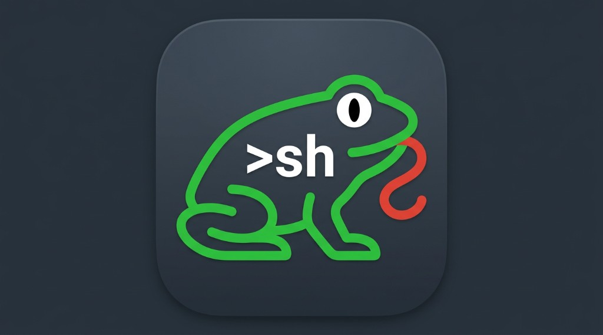
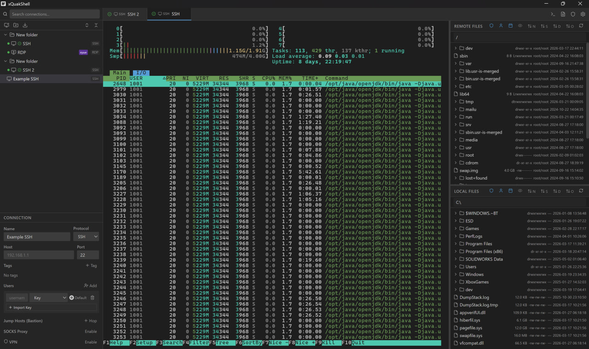
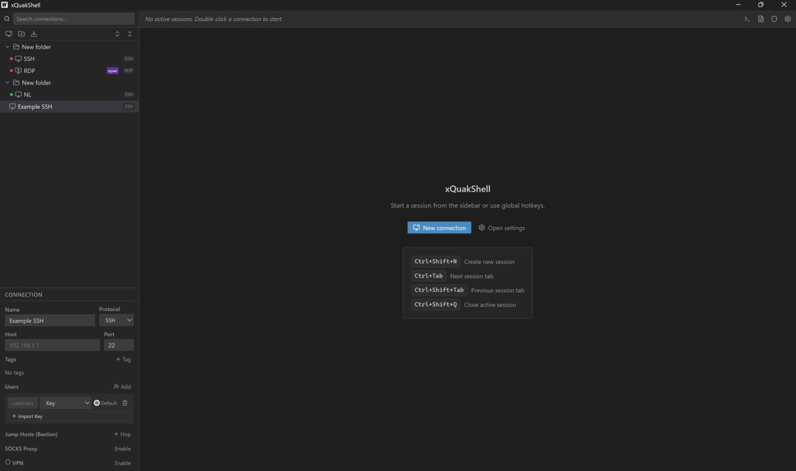
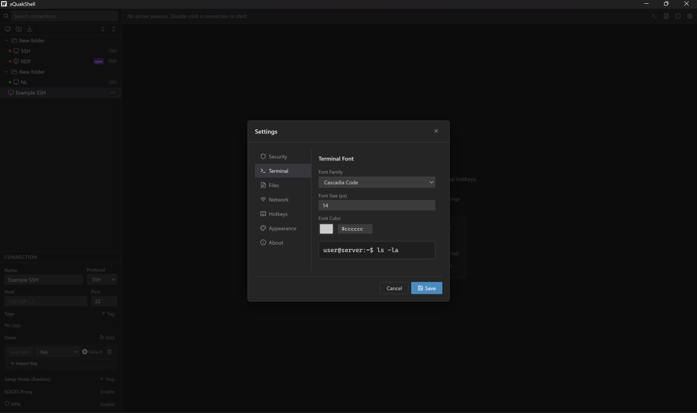
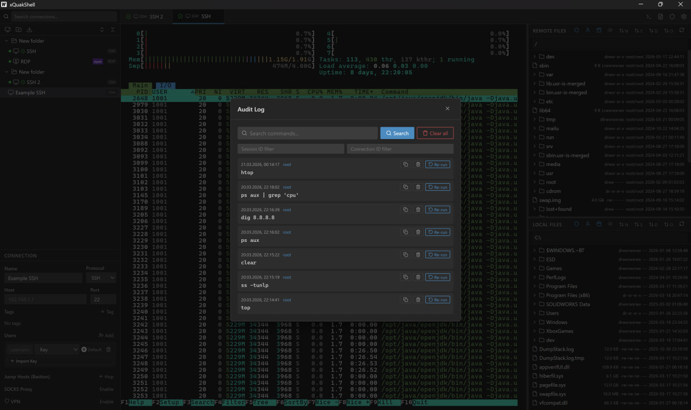
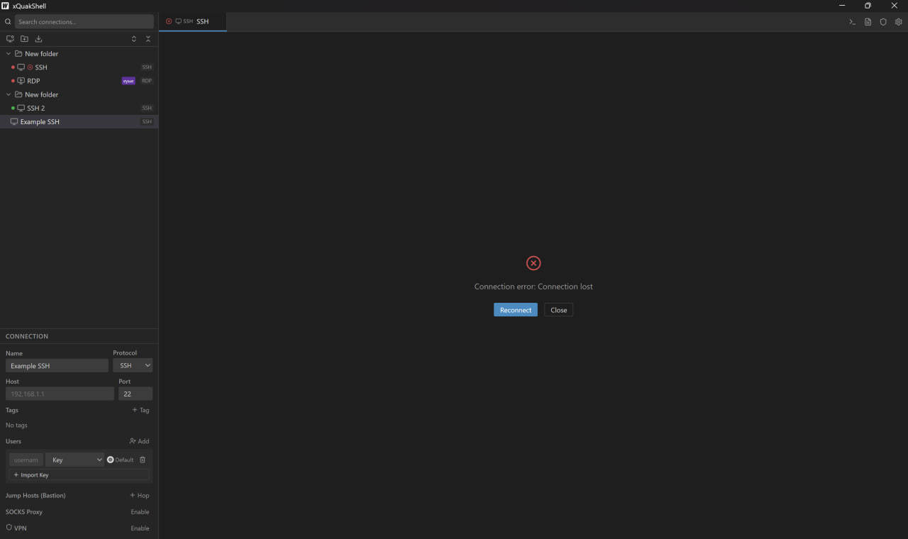
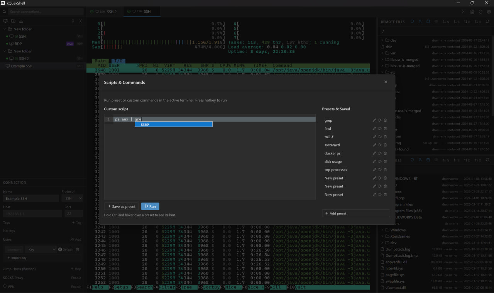

# xQuakShell

<p align="center">
  
</p>

<p align="center">
  <strong>Portable and secure multi-protocol remote connection manager.</strong><br/>
</p>

<p align="center">
  <a href="#features">Features</a> •
  <a href="#screenshots">Screenshots</a> •
  <a href="#quick-start">Quick Start</a> •
  <a href="#building">Building</a> •
  <a href="#documentation">Documentation</a>
</p>

---

## Features

- Encrypted vault (`vault.age`) for connections, keys, credentials, known hosts.
- Multi-protocol sessions: SSH, RDP, Telnet, Serial, HTTP.
- Multi-tab session workflow with independent lifecycle.
- Integrated terminal + SFTP file manager (upload/download/rename/delete/create).
- Strict SSH host key verification, jump hosts, SOCKS proxy, VPN profiles.
- Portable Windows build with bundled WebView2 runtime (`make portable`).

## Screenshots

### Main workspace



### Default screen



### Settings



### Audit log



### Connection lost dialog



### Scripts builder



---

## Quick Start

### Prerequisites

- Go 1.24+
- Node.js 18+
- Wails CLI v2 (`go install github.com/wailsapp/wails/v2/cmd/wails@latest`)

### Production build

```bash
make install
make build
```

Output: `build/bin/xQuakShell.exe`

### Portable build (Windows)

```bash
make portable
```

Bundles WebView2 Fixed Runtime into `build/bin/WebView2/`.

---

## Building

| Target | Command | Description |
|--------|---------|-------------|
| Build app | `make build` | Full Wails build |
| Portable | `make portable` | Build + WebView2 Fixed Runtime |
| Install deps | `make install` | Frontend dependencies |
| Clean | `make clean` | Remove build artifacts |

### Build modes

- `make build`: compact output, requires WebView2 runtime on target machine.
- `make portable`: larger output, works on clean/offline Windows machines.

---

## Security

- Master password protects vault using age + scrypt.
- Strict host key checks (no silent auto-accept).
- Sensitive data is not stored in plaintext config files.
- Session lockout and local audit log are included.

---

## Project Structure

```text
xQuakShell/
  app.go
  main.go
  frontend/src/
  internal/
    domain/
    usecase/
    infra/
    presentation/wails/
  test/unit/
```

---

## Documentation

- [Usage Guide](./USAGE.md)
- [Contributing](./CONTRIBUTING.md)
- [Security Policy](./SECURITY.md)

---

## License

See [LICENSE](./LICENSE).

