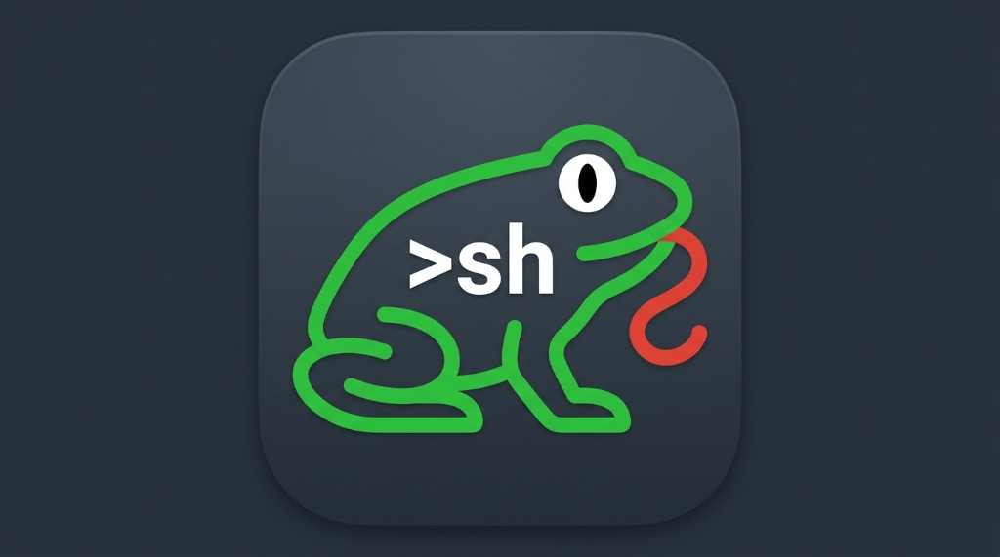
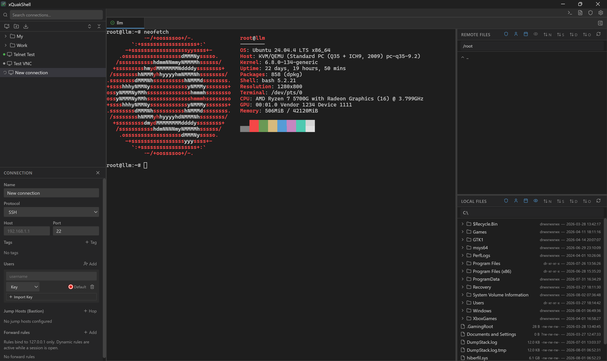
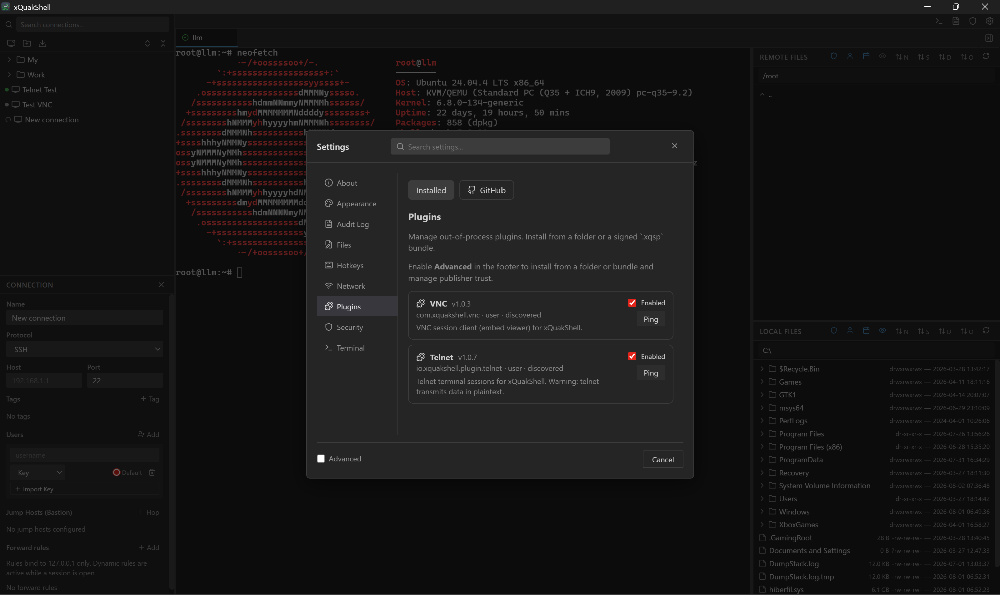
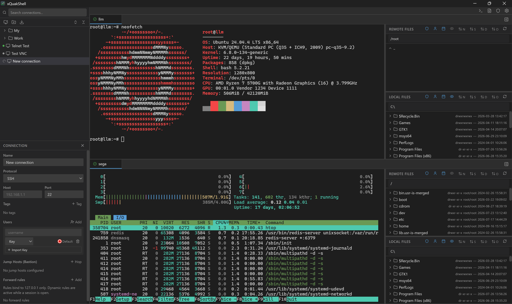

# xQuakShell

<p align="center">
  
</p>

<p align="center">
  <strong>Portable, secure remote-access platform, extensible via out-of-process plugins.</strong>
</p>

<p align="center">
  <a href="./LICENSE"></a>
  
  
  <!--  -->
  <a href="https://t.me/xQuakShell"></a>
</p>

<p align="center">
  <a href="#why-xquakshell">Why</a> •
  <a href="#features">Features</a> •
  <a href="#screenshots">Screenshots</a> •
  <a href="#quick-start">Quick Start</a> •
  <a href="#building">Building</a> •
  <a href="#documentation">Documentation</a> •
  <a href="#community">Community</a>
</p>

---

## Why xQuakShell

Most SSH clients force a choice: either you get a polished terminal with no real extensibility, or you get "plugins" that are just DLLs running with full access to your process, your vault, and your filesystem.

xQuakShell doesn't make you choose:

- **Portable by design.** No installer, no registry, no system-wide state. The vault, audit log, and every installed plugin live next to the executable file. Copy the folder to a USB stick and your whole setup — connections, keys, plugins — moves with it.
- **A plugin system you can actually trust.** Every plugin is a separate OS process, sandboxed with memory/handle limits (Job Objects on Windows, rlimits on Linux/macOS), talking to the core only through a capability-gated JSON-RPC channel. A plugin declares in its manifest exactly which files, hosts, and vault fields it needs — anything outside that is rejected before it ever executes, and denied calls are audit-logged. See [Security Model](./docs/security-model.md).
- **Protocols are contributions, not core features.** SSH ships in the core. Everything else — VNC, Telnet, RDP, Discovery plugins, whatever you need next — is a `SessionConnector` implementation registered through a plugin manifest. You're not waiting on a roadmap to add a protocol; you can build it.
- **Nothing silently trusts the network.** Strict host-key verification with no auto-accept, an encrypted vault (age + scrypt) instead of plaintext config, and a local audit log that records actions without ever recording secrets.

If you manage servers from a laptop that leaves the office, or you need a remote-access tool you can extend without giving every plugin the keys to the whole app, this is the tradeoff xQuakShell is built around.

---

## Features

- Encrypted vault (`vault.age`) for connections, keys, credentials, known hosts — protected by a master password (age + scrypt), with no password recovery by design (nothing to leak).
- SSH terminal + SFTP file manager (upload/download/rename/delete/create), multi-tab sessions with independent lifecycle.
- Jump hosts and strict host key verification (no silent auto-accept).
- Local/remote/dynamic port forwarding.
- Out-of-process plugin system: sandboxed, capability-gated, versioned IPC handshake, resource-limited, extensible to new connection protocols — installable straight from GitHub or as signed `.xqsp` bundles.
- Local audit log and session lockout, with secret redaction at the IPC boundary.
- Portable Windows build with bundled WebView2 runtime (`make portable`) — works on clean/offline machines.

## Official plugins

Protocols beyond SSH are provided by sandboxed, out-of-process plugins installed
from GitHub through the in-app plugin manager. The officially maintained ones:

| Plugin | Protocol | Links |
|--------|----------|-------|
| **VNC** — remote desktop in an embedded noVNC viewer (fit-to-window, quality/bandwidth controls, auto-reconnect) | `vnc` | [Releases](https://github.com/teoritty/xqs-plugin-vnc/releases) · [Source](https://github.com/teoritty/xqs-plugin-vnc) |
| **Telnet** — plaintext terminal sessions, optional auto-login | `telnet` | [Releases](https://github.com/teoritty/xqs-plugin-telnet/releases) · [Source](https://github.com/teoritty/xqs-plugin-telnet) |

Want to build your own? Start with the [Plugin API Reference](./docs/plugin-api.md) and [Plugin Manifest schema](./docs/plugin-manifest.md).

## Screenshots

### Main workspace



### Plugins



### Tiles



---

## Download

Every release publishes portable archives — unpack and run, no installer, no system-wide state.
`SHA256SUMS` covers every archive: `sha256sum -c SHA256SUMS --ignore-missing`.

| Platform | Archive | Pick this one when |
|----------|---------|--------------------|
| Windows | `…-windows-amd64-portable.zip` | The machine already has the WebView2 runtime (Windows 11, and most Windows 10 installs) |
| Windows | `…-windows-amd64-portable-webview2.zip` | Clean or offline machines — WebView2 Fixed Runtime is bundled |
| Linux | `…-linux-amd64-webkit4.1.tar.gz` | Ubuntu 22.04+, Debian 12+, Fedora 40+, Arch — start here |
| Linux | `…-linux-amd64-webkit4.0.tar.gz` | Older systems still carrying the webkit2gtk-4.0 runtime |

Each archive unpacks into a folder of its own and carries a README. Windows will show
"Windows protected your PC" on first run — the binaries are not code-signed, so SmartScreen has no
publisher to check; **More info → Run anyway**, or verify the archive against `SHA256SUMS` first.

WebKitGTK is part of the Linux system and cannot be bundled the way WebView2 is on Windows, and its
4.0 and 4.1 ABIs are not interchangeable — hence two archives. Both are built against glibc 2.35
and require it or newer. If the wrong one is unpacked, the launcher says so and names the package
to install. The Linux archive carries a launcher, a desktop entry and its own README; run
`./install-desktop-entry.sh` to add it to the application menu.

---

## Quick Start

### Prerequisites

- Go 1.25.12+ (earlier 1.25 patches carry known stdlib vulnerabilities)
- Node.js 18+
- Wails CLI v2 (`go install github.com/wailsapp/wails/v2/cmd/wails@latest`)

### Production build

```bash
make install
make build
```

Output: `build/bin/xQuakShell.exe`

### Portable build (Windows)

```bash
make portable
```

Bundles WebView2 Fixed Runtime into `build/bin/WebView2/`.

### Linux build

```bash
sudo apt install libgtk-3-dev libwebkit2gtk-4.1-dev   # 4.0-dev on older distributions
wails build -platform linux/amd64 -tags webkit2_41    # drop the tag to link webkit2gtk-4.0
```

The release archives are assembled by `.github/workflows/release.yml`, which adds the launcher,
desktop entry and icon from `packaging/linux/`.

---

## Building

| Target | Command | Description |
|--------|---------|-------------|
| Build app | `make build` | Full Wails build |
| Portable | `make portable` | Build + WebView2 Fixed Runtime |
| Install deps | `make install` | Frontend dependencies |
| Clean | `make clean` | Remove build artifacts |

### Build modes

- `make build`: compact output, requires WebView2 runtime on target machine.
- `make portable`: larger output, works on clean/offline Windows machines.

---

## Security

xQuakShell's plugin sandbox is enforced at multiple layers, not just "trust the manifest":

| Layer | What it enforces |
|-------|-------------------|
| **Process isolation** | Each plugin runs as its own OS process; per-plugin or per-session isolation modes; killed on host shutdown or crash, restarted with backoff. |
| **Capability gate** | Every plugin→core call (`fs.*`, `net.dial`, `vault.getSecret`, …) is checked against the plugin's declared manifest capabilities; unmatched calls are denied and logged, never silently allowed. |
| **API version handshake** | The core, not the plugin, is the authority on compatibility — a plugin's echoed version is never trusted for enforcement. |
| **Resource limits** | Memory/handle caps via Job Objects (Windows) or rlimits (Linux/macOS/BSD); oversized IPC frames and file reads/writes are rejected. |
| **Ownership checks (IDOR)** | Vault and session access is scoped to the plugin that owns the active session — a plugin can't reach another plugin's or another session's data. |
| **Secrets** | Vault contents are encrypted at rest (age + scrypt); secret field values never round-trip to plugin logs, audit logs, or the frontend after save. |

Full write-up in [Security Model](./docs/security-model.md) and the [ADRs](./docs/adr/).

If you find a vulnerability, please follow the process in [SECURITY.md](./SECURITY.md) rather than opening a public issue.

---

## Documentation

- [Usage Guide](./USAGE.md)
- [Architecture & extensibility](./docs/architecture.md)
- [Plugin API Reference](./docs/plugin-api.md)
- [Plugin Manifest schema](./docs/plugin-manifest.md)
- [Security Model](./docs/security-model.md)
- [Contributing](./CONTRIBUTING.md)
- [Security Policy](./SECURITY.md)

---

## Community

Questions, feedback, or just want to follow development? Join the Telegram channel: **[t.me/xQuakShell](https://t.me/xQuakShell)**

---

## License

See [LICENSE](./LICENSE) (GPLv3).