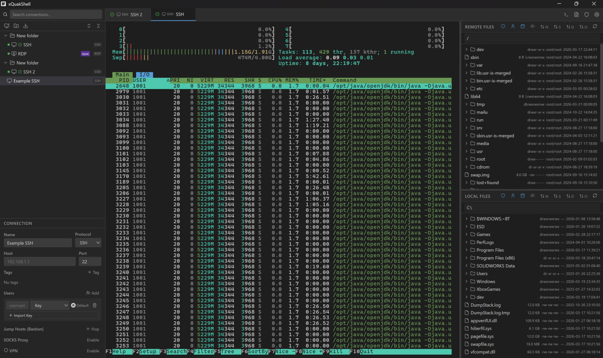
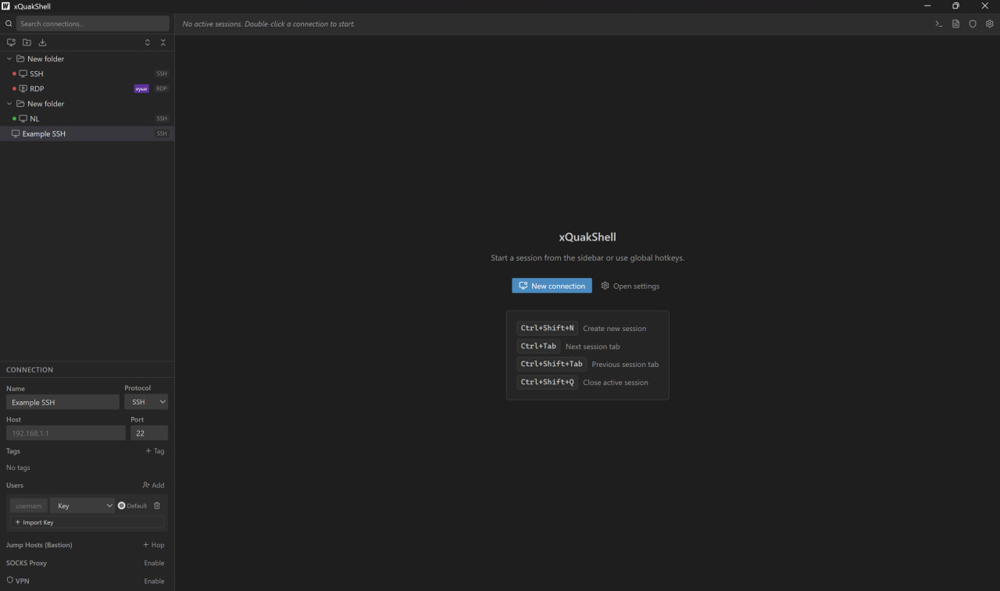
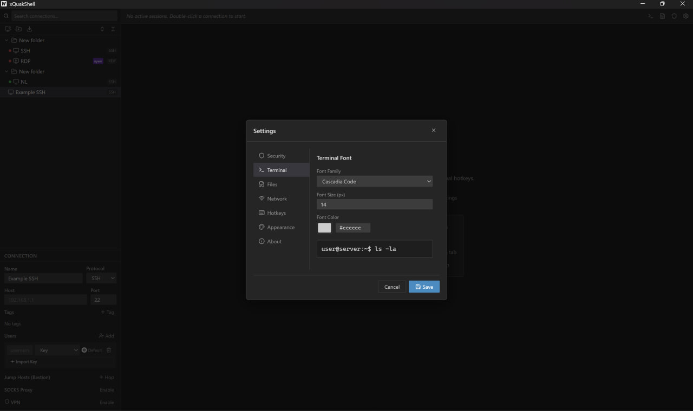
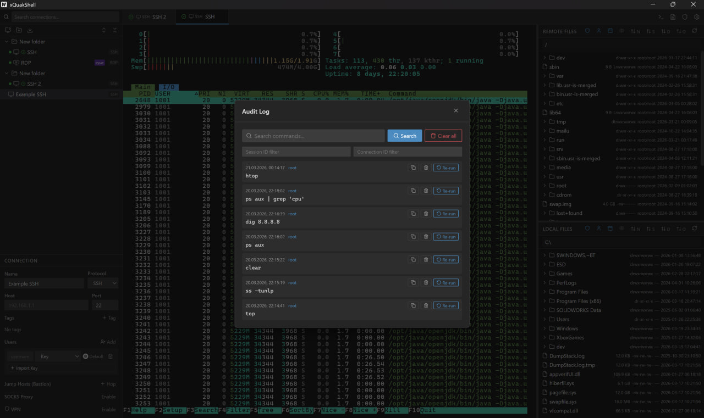
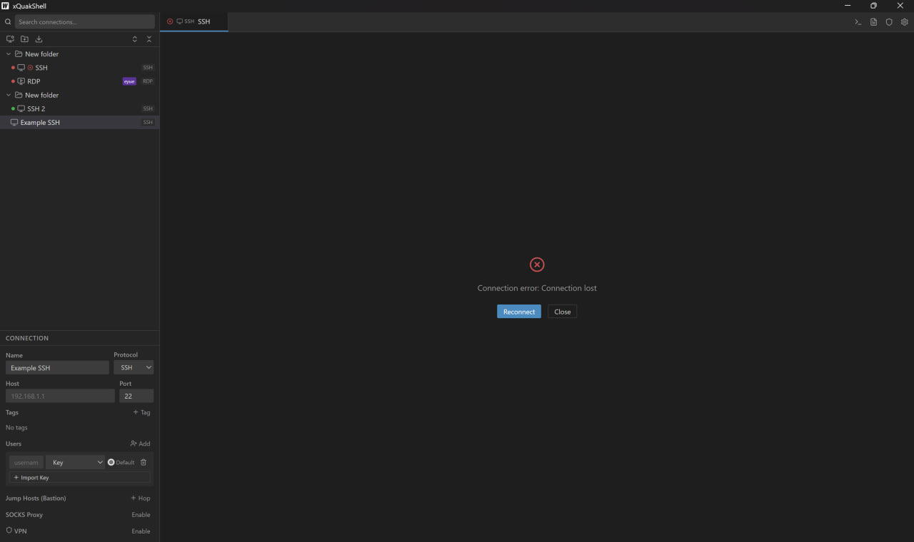
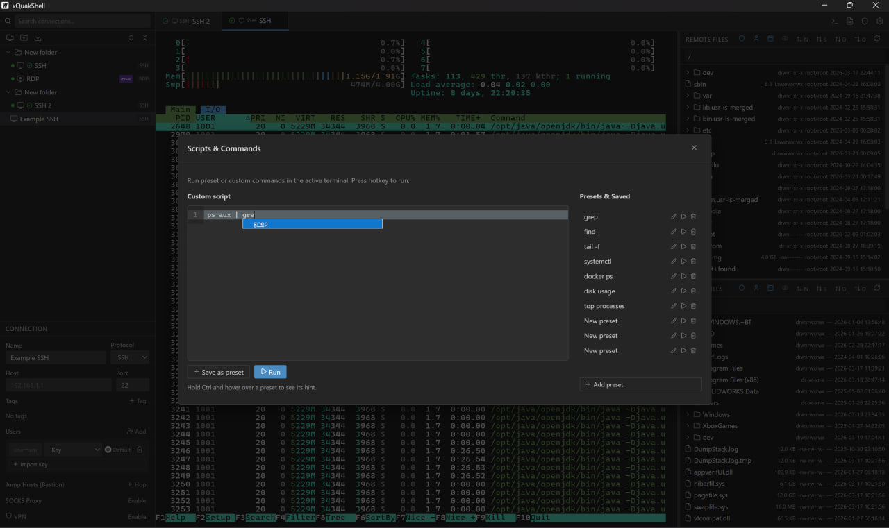

# xQuakShell

<p align="center">
  
</p>

<p align="center">
  <strong>Portable, secure remote-access platform — SSH out of the box, extensible via out-of-process plugins.</strong><br/>
</p>

<p align="center">
  <a href="#scope">Scope</a> •
  <a href="#features">Features</a> •
  <a href="#screenshots">Screenshots</a> •
  <a href="#quick-start">Quick Start</a> •
  <a href="#building">Building</a> •
  <a href="#documentation">Documentation</a>
</p>

---

## Scope

xQuakShell is a remote-access platform. Out of the box it ships a complete **SSH** stack: terminal, SFTP, jump hosts, port forwarding, and strict host key verification. Everything else is added through plugins rather than baked into the core.

**Protocols are plugins, not a hardcoded list.** The shipped SSH connector is itself just one implementation of the `SessionConnector` interface. A `ConnectionProtocolContribution` schema lets a plugin register a new protocol — its own connection fields, auth flow, and session type — without touching core code. Today SSH is the only protocol installed; RDP/VNC/other protocols are things you can build, not things you have to wait for us to ship.

**Plugins run out-of-process.** Each plugin is a separate sandboxed process, talking to the core over a framed IPC channel with backpressure. Access to filesystem, network, tunnels, and vault is mediated by an explicit capability layer — a plugin only gets what it's granted, so a bad or malicious plugin can't reach past its sandbox into the rest of the app. Plugins can be installed directly from GitHub. See [Architecture](./docs/architecture.md) and [Contributing](./CONTRIBUTING.md).

---

## Features

- Encrypted vault (`vault.age`) for connections, keys, credentials, known hosts — protected by a master password (age + scrypt).
- SSH terminal + SFTP file manager (upload/download/rename/delete/create), multi-tab sessions with independent lifecycle.
- Jump hosts and strict host key verification (no silent auto-accept).
- Local/remote/dynamic port forwarding.
- Out-of-process plugin system: sandboxed, capability-gated, extensible to new connection protocols — installable from GitHub.
- Portable Windows build with bundled WebView2 runtime (`make portable`).

## Screenshots

### Main workspace



### Default screen



### Settings



### Audit log



### Connection lost dialog



### Scripts builder



---

## Quick Start

### Prerequisites

- Go 1.24+
- Node.js 18+
- Wails CLI v2 (`go install github.com/wailsapp/wails/v2/cmd/wails@latest`)

### Production build

```bash
make install
make build
```

Output: `build/bin/xQuakShell.exe`

### Portable build (Windows)

```bash
make portable
```

Bundles WebView2 Fixed Runtime into `build/bin/WebView2/`.

---

## Building

| Target | Command | Description |
|--------|---------|-------------|
| Build app | `make build` | Full Wails build |
| Portable | `make portable` | Build + WebView2 Fixed Runtime |
| Install deps | `make install` | Frontend dependencies |
| Clean | `make clean` | Remove build artifacts |

### Build modes

- `make build`: compact output, requires WebView2 runtime on target machine.
- `make portable`: larger output, works on clean/offline Windows machines.

---

## Security

- Master password protects vault using age + scrypt.
- Strict host key checks (no silent auto-accept).
- Sensitive data is not stored in plaintext config files.
- Session lockout and local audit log are included.

---

## Project Structure

```text
xQuakShell/
  main.go              # Wails bootstrap, calls composeApp()
  main_compose.go      # composition root: core DI
  main_ssh_auth.go     # composition root: plugin SSH auth wiring
  main_plugins.go      # composition root: plugin runtime
  main_connectors.go   # composition root: session connectors
  app.go               # Wails binding facade (no DI)
  frontend/src/
  internal/
    domain/
    usecase/
    infra/
    presentation/wails/
  test/unit/
```

---

## Documentation

- [Usage Guide](./USAGE.md)
- [Architecture & extensibility](./docs/architecture.md)
- [Contributing](./CONTRIBUTING.md)
- [Security Policy](./SECURITY.md)

---

## License

See [LICENSE](./LICENSE).

