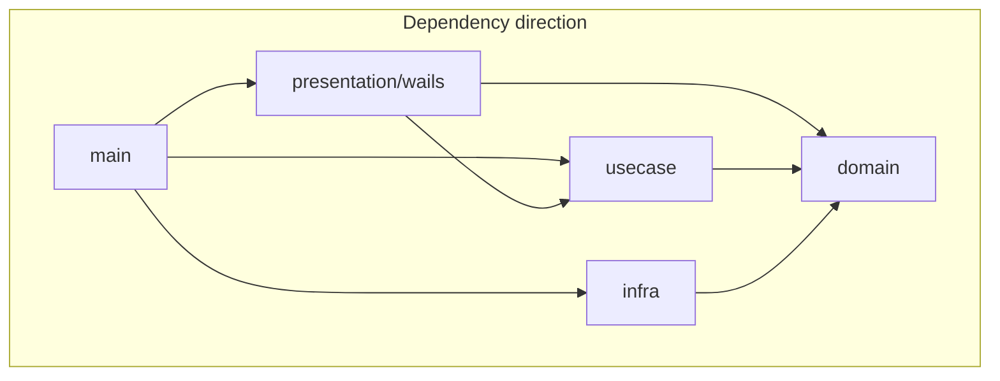

# Architecture (xQuakShell)

This document complements [CONTRIBUTING.md](../CONTRIBUTING.md) with layer rules and where to add features.

## Layer diagram

- **main** (`app.go`) wires repositories, SSH adapters (`internal/infra/ssh`), portable layout, and plugin runtime.
- **presentation/wails** — Wails facade: `api.go`, handler files, DTOs, events. Handlers delegate to use cases; no direct infra imports.
- **usecase** — orchestration (`SessionManager`, `TransferService`, `AuditService`, `SettingsService`, plugins). Depends only on **domain** and stdlib.
- **domain** — entities and ports split across `vault_data.go`, `app_settings.go`, `repositories.go`, `local_fs.go`, etc.
- **infra** — persistence, SSH dialer, SFTP, audit log, portable local FS, plugin host, etc.

## Import rules (summary)

| Package | May import |
|--------|-------------|
| `internal/domain` | stdlib, `golang.org/x/crypto/ssh`, `internal/domain/*` — **not** `internal/presentation`, `internal/infra`, `internal/pkg`, `main` |
| `internal/usecase` | `internal/domain`, stdlib — **not** `internal/infra/*`, `internal/pkg/*`, third-party |
| `internal/infra/*` | `internal/domain`, `internal/pkg`, third-party, stdlib |
| `internal/presentation/wails` | `internal/domain`, `internal/usecase`, stdlib |
| `main` | all internal packages as needed for composition |

Run `powershell -File scripts/check-imports.ps1` to verify layer imports.

## SSH types in domain

The project uses a **thin domain** over `golang.org/x/crypto/ssh`: interfaces such as `SSHClient`, `SSHClientConfig`, and `KnownHostsRepository` use `ssh` types in signatures. New domain ports should not introduce unrelated third-party types; keep SSH as the single external crypto dependency in `domain`.

## Plugin seam (SessionConnector)

SSH sessions are handled natively in `SessionManager.connectSession`. Non-SSH protocols can be added as **plugins** by implementing `domain.SessionConnector` and registering the implementation in `main_connectors.go`.

The core ships with an **empty connector registry** (`newSessionConnectors()` returns `nil`). When a connection uses a non-SSH `protocol` value and no plugin is registered, `OpenSession` transitions to error: `protocol X not yet implemented`.

Plugin connectors receive `ConnectorHooks` to set PTY bridge, SFTP (`RemoteFS`), SSH client, and to call `OnStreamReady` for stream-based terminals.

## Where to add features

| Area | Entry points |
|------|----------------|
| **Vault / connections** | Repositories in `internal/infra/persistence`, DTOs in `dto_connection.go`, handlers in `handlers_vault.go`. |
| **SSH sessions** | `internal/usecase/session_manager*.go`, PTY/SFTP init via `SessionManager.InitSessionIO`, handlers in `handlers_sessions.go`. |
| **Remote file browser** | `handlers_remote_fs.go` (DTO mapping); SSH exec via `SessionManager.Exec`. |
| **Local file browser** | `domain.LocalFileSystem` port, `internal/infra/portable/local_fs.go`, `handlers_local_fs.go`. |
| **Transfers** | `internal/usecase/transfer_service.go`, handlers in `handlers_transfers.go`. |
| **Settings / ping / audit** | `settings_service.go`, `audit_service.go`, `ping_manager.go`, `handlers_settings_ping_audit.go`. |
| **Plugins** | `internal/usecase/plugin_*.go`, handlers in `handlers_plugin*.go`, manifest FS checks in `infra/plugin/bundle/capabilities_validate.go`. |
| **Plugin protocols** | Implement `domain.SessionConnector`, register in `main_connectors.go`. |

## Tests

- Use case SSH flows: `internal/usecase/session_manager_ssh_test.go` (no network; mocked ports).
- Broader unit tests: `test/unit/`.
