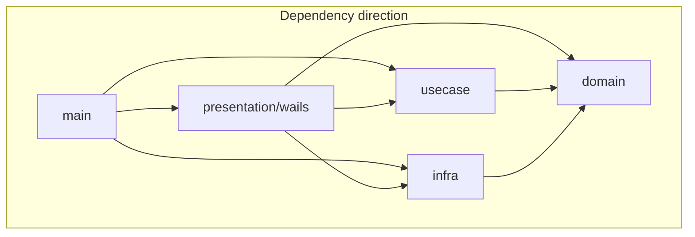

# Architecture (xQuakShell)

This document complements [CONTRIBUTING.md](../CONTRIBUTING.md) with layer rules and where to add features.

## Layer diagram

- **main** wires repositories, SSH adapters (`internal/infra/ssh`), and optional `SessionConnector` plugins via `main_connectors.go`.
- **presentation/wails** — Wails API (`api.go`, `handlers_wails.go`), DTOs, events. May depend on `infra` for thin adapters (e.g. PTY bridge).
- **usecase** — orchestration (`SessionManager`, `PingManager`, lockout). Depends only on **domain** and the standard library.
- **domain** — entities, ports, and the chosen SSH surface (see below).
- **infra** — persistence, SSH dialer, SFTP, audit log, PuTTY import, etc.

## Import rules (summary)

| Package | May import |
|--------|-------------|
| `internal/domain` | stdlib, `golang.org/x/crypto/ssh` (ports only; see CONTRIBUTING) — **not** `internal/presentation`, `internal/infra`, `main` |
| `internal/usecase` | `internal/domain`, stdlib — **not** `internal/infra/*` |
| `internal/infra/*` | `internal/domain`, third-party, stdlib |
| `internal/presentation/wails` | `internal/domain`, `internal/usecase`, `internal/infra/*` (adapters), stdlib |
| `main` | all internal packages as needed for composition |

## SSH types in domain

The project uses a **thin domain** over `golang.org/x/crypto/ssh`: interfaces such as `SSHClient`, `SSHClientConfig`, and `KnownHostsRepository` use `ssh` types in signatures. New domain ports should not introduce unrelated third-party types; keep SSH as the single external crypto dependency in `domain`.

## Plugin seam (SessionConnector)

SSH sessions are handled natively in `SessionManager.connectSession`. Non-SSH protocols can be added as **plugins** by implementing `domain.SessionConnector` and registering the implementation in `main_connectors.go`.

The core ships with an **empty connector registry** (`newSessionConnectors()` returns `nil`). When a connection uses a non-SSH `protocol` value and no plugin is registered, `OpenSession` transitions to error: `protocol X not yet implemented`.

Plugin connectors receive `ConnectorHooks` to set PTY bridge, SFTP (`RemoteFS`), SSH client, and to call `OnStreamReady` for stream-based terminals.

## Where to add features

| Area | Entry points |
|------|----------------|
| **Vault / connections** | Repositories in `internal/infra/persistence`, mapping in `internal/presentation/wails/dto_connection.go`, API methods in `handlers_vault.go` (folders, connections, passwords). |
| **SSH sessions** | `internal/usecase/session_manager.go` (`connectSession`), `internal/infra/ssh`, PTY/SFTP init in `handlers_wails.go` (`initSessionPTYAndSFTP`). |
| **Plugin protocols** | Implement `domain.SessionConnector`, register in `main_connectors.go`. |
| **Transfers** | SFTP/transfer limits via vault settings; upload/download in `handlers_wails.go` (`acquireTransferSlot`, etc.). |

## Tests

- Use case SSH flows: `internal/usecase/session_manager_ssh_test.go` (no network; mocked ports).
- Broader unit tests: `test/unit/`.
